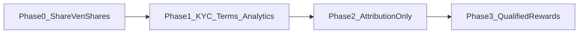

# Gated “Share VenShares” and future referral system

## Validation of your framing

Your concerns are the right ones for an equity-adjacent marketplace: **general solicitation**, **broker-dealer / promotion** questions, **abuse via open invite URLs**, and **reward timing** tied to share-like outcomes are not implementation details—they are **policy + counsel** decisions. The plan below treats **legal review as a hard gate** before any “referrer gets X when referee does Y” behavior, especially when Y touches projects or equity narrative.

This document is **not legal advice**; it only sequences engineering so you do not accidentally ship the risky variant.

## Current codebase (baseline)

- **Auth**: Email/password via Supabase in [`web/src/components/auth/register-form.tsx`](web/src/components/auth/register-form.tsx) and [`web/src/components/auth/login-form.tsx`](web/src/components/auth/login-form.tsx). Register does **not** read `ref`, UTM, or cookies.
- **Protection**: [`web/src/lib/supabase/middleware.ts`](web/src/lib/supabase/middleware.ts) redirects unauthenticated users away from `/dashboard` and `/project` only—good baseline (no deep link straight into project equity flows).
- **Profiles**: Minimal columns in [`web/supabase/migrations/001_initial_schema.sql`](web/supabase/migrations/001_initial_schema.sql) (`email`, `username`, names)—no `referred_by`, account type, or KYC flags.
- **Marketing entry**: [`web/src/app/(site)/join/page.tsx`](web/src/app/(site)/join/page.tsx) is a simple CTA to register/login.
- **Analytics**: No first-party event pipeline in the app yet (nothing like PostHog/GA in TS/TSX), so “quality of referred users” is not measurable in-product today.

## What not to ship (until gated)

- **Auto project access** or **pre-provisioned invites** from a shared URL.
- **Referral rewards** (credits, fee discounts, “equity” language, or anything that could be read as **compensation for recruiting** into an offering) without counsel-approved terms and a defined compliance wrapper.
- **Opaque long-lived tokens** in URLs that could be forwarded indefinitely without rate limits, audit trail, or abuse controls.

## Recommended phases

### Phase 0 — “Share VenShares” (discovery only, no referral program)

**Goal**: Word-of-mouth without claiming a “referral program,” without unique codes, without automatic relationship between sharer and signup.

- **UI**: A **Share VenShares** control (e.g. dashboard or settings) that copies a **single public URL** (e.g. [`/join`](web/src/app/(site)/join/page.tsx) or marketing home) using the Web Share API / `navigator.clipboard` with a **short, honest label** (“Invite friends to learn about VenShares” — not “earn shares”).
- **Optional**: Append **static** UTM query params for your own campaigns (`utm_source=app&utm_medium=share_button`) — still not user-unique; avoids building referrer identity in the URL.
- **Copy**: Inline note that signup is subject to normal onboarding and eligibility; no promise of project access or compensation.

**Risk posture**: Lowest; comparable to sharing any public landing page.

### Phase 1 — Prerequisites (your stated gates)

Before **unique** referral links or **any** reward:

1. **KYC / identity** — product decision + vendor (e.g. Persona, Stripe Identity) and where it blocks **project creation**, **joining as professional**, or **share-related actions**.
2. **Terms** — separate **“discovery referral”** (if any) from **participation in projects / equity-like arrangements**; counsel to approve language and any incentive structure.
3. **Analytics** — minimal event model: `signup_completed`, `profile_completed`, `project_created`, `hours_logged` (when you have that domain model), with optional `utm_*` / `ref` dimensions once Phase 2 exists.
4. **Legal sign-off** on whether **tracked referral + rewards** is permissible in your intended user set and jurisdictions.

### Phase 2 — Gated attribution (tracked link, no rewards yet)

**Goal**: Measure **who invited whom** and funnel quality, without paying or promising consideration.

- **Data model** (new migration): e.g. `referral_codes` (or `referral_links`) with `user_id`, `code` or opaque id, `created_at`, `expires_at`, `revoked_at`, optional `max_uses`; and `profiles.referred_by_user_id` or a join table `referrals` for auditability.
- **Flow**: `GET /join?ref=CODE` (or `/r/CODE` redirect) sets a **first-party, HttpOnly, short-lived cookie** (or server-stored pending referral keyed by session) so the **full** [`RegisterForm`](web/src/components/auth/register-form.tsx) + email confirmation path still runs; on first successful profile row write, persist attribution **once** (ignore overwrites).
- **Server truth**: Code validation via **Route Handler** or **Edge Function** so codes cannot be forged client-side; rate-limit code creation and signup attempts (you already have [`web/supabase/migrations/002_rate_limits.sql`](web/supabase/migrations/002_rate_limits.sql) — extend patterns as needed).
- **Abuse**: Per-user caps on active codes, expiration, revocation, and monitoring for burst signups from single codes.

### Phase 3 — Qualified rewards (only after Phase 1 sign-off)

**Goal**: “Reward referrer only on **meaningful** actions” as you described.

- Implement **business-defined milestones** as explicit state machines (e.g. “referee completed profile + verified identity,” “referee contributed N hours on an approved project,” “inventor idea approved”) backed by **immutable audit events**.
- **Idempotent** reward application; no double-credit; admin tooling to reverse fraudulent referrals.
- **No** automatic equity or securities language in the share UI without counsel-approved disclosure flow.

## Near-term implementation note

If you approve execution after this plan, the **smallest** change set is **Phase 0 only** (button + copy + public URL + optional static UTMs). Phases 2–3 should wait until the Phase 1 checklist is satisfied.
