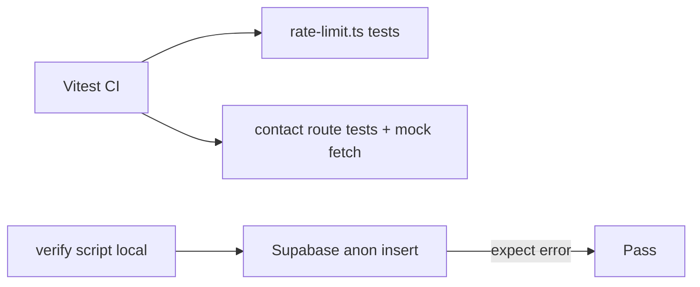

# Testing plan: contact flow and `rate_limits` RLS

## Limits of what we can automate

- **Live Supabase RLS** cannot be asserted from this workspace without your project URL and anon key. The plan includes a **small opt-in script** you run locally (loads [`.env.local`](web/.env.local) or env vars) that fails if anon can still insert into `rate_limits`.
- **CI** can run **Vitest** tests that do not call Supabase: pure logic + mocked `fetch`.

## 1. Add Vitest to the web app

- Add `vitest` (and `@vitejs/plugin-react` only if we later test components; skip for API-only).
- Add [`web/vitest.config.ts`](web/vitest.config.ts) with `resolve.alias` matching [`tsconfig.json`](web/tsconfig.json) (`@` → `./src`).
- Add script in [`web/package.json`](web/package.json): `"test": "vitest run"` and `"test:watch": "vitest"`.

## 2. Unit tests: [`web/src/lib/rate-limit.ts`](web/src/lib/rate-limit.ts)

- Test same `key`, `max: 5`, small `windowMs`: first five calls return `ok: true`, sixth returns `ok: false` with `retryAfterSec` present.
- Use a **unique key per test** (e.g. `test-rate-${randomUUID()}`) so parallel test files do not share the module-level `Map`.

## 3. Unit tests: [`web/src/app/api/contact/route.ts`](web/src/app/api/contact/route.ts)

- **`vi.stubGlobal("fetch", ...)`** to avoid real Edge Function calls.
- Before importing `POST`, set `process.env.CONTACT_FUNCTION_URL` and `process.env.CONTACT_FORM_KEY` (or use `vi.stubEnv` in Vitest 2).
- Cases:
  - Valid JSON body → `POST` returns 200, `fetch` called once with correct headers/body shape and `X-Contact-Form-Key`.
  - Invalid body (Zod) → 400.
  - Invalid JSON → 400.
  - Upstream `fetch` returns non-OK → 502.
  - Six rapid requests with the **same** synthetic IP (set `x-forwarded-for` on `NextRequest`) → sixth gets **429** from the Next route limiter (proves the app-side throttle still works).

## 4. Optional: RLS smoke script (migration 003)

- Add e.g. [`web/scripts/verify-rate-limits-rls.mts`](web/scripts/verify-rate-limits-rls.mts) (or `.ts` run with `npx tsx`):
  - Read `NEXT_PUBLIC_SUPABASE_URL` and `NEXT_PUBLIC_SUPABASE_ANON_KEY` from the environment (document: `dotenv` load from `.env.local` or export vars manually).
  - `createClient(url, anonKey)` → `from("rate_limits").insert({ ip_address: "rls-verify" })`.
  - **Expect** `error` (RLS / permission). If insert succeeds, `console.error` and `process.exit(1)`.
- Add `"verify:rate-limits-rls": "tsx scripts/verify-rate-limits-rls.mts"` (add `tsx` as devDependency if not using `node --import tsx`).

## 5. Docs

- Short bullet in [`web/README.md`](web/README.md): `npm test` for CI-safe tests; `npm run verify:rate-limits-rls` after configuring env (confirms anon cannot write `rate_limits`).

## Files touched (summary)

| Action | File |
|--------|------|
| New | `web/vitest.config.ts` |
| New | `web/src/lib/rate-limit.test.ts` |
| New | `web/src/app/api/contact/route.test.ts` |
| New | `web/scripts/verify-rate-limits-rls.mts` (optional but recommended) |
| Edit | `web/package.json` (deps + scripts) |
| Edit | `web/README.md` |

No changes to production runtime code unless we add a tiny `export function clearRateLimitBucketsForTest()` — **not needed** if tests use unique keys for rate-limit tests and a fixed IP only inside the contact route test file.
