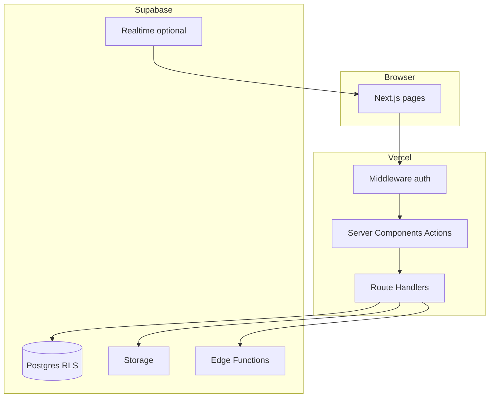

# VenShares — New App Plan (Business + Architecture + Phases)

## Current workspace reality

- **No new app at repo root yet.** The only implemented site is [old_website_code_for_reference/venshares-vite/](old_website_code_for_reference/venshares-vite/): **Vite + React 19 + React Router + Supabase** (auth, `projects` / `files`, Storage bucket `project-files`, Edge Functions for email/contact).
- **Design reference assets live in** [documents_for_reference/](documents_for_reference/) **at repo root** (full path: `venshares_grok/documents_for_reference/`). Inventory includes: `LandingPage.pdf`; `2 InventorsLanding.pdf`; `2b ProfessionalsLanding.pdf`; account flows (`CreateAccount*.pdf`, `Login.pdf`); inventor flows (`SubmitIdeaInventor.pdf`, `SubmitIdeaInventorPage2.pdf`); **Idea Arena** (`IdeaArena.pdf`, `IdeaArena-ProjectDetails.pdf`); **project workspace** (`ProjectWorkspace.pdf`, `ProjectWorkspace v2.pdf`, `ProjectWorkspace Deliverables.pdf`, `ProjectWorkspaceMeeting.pdf`); pitch visuals (`Idea area from pitch deck.png`, `idea specifics pitch deck.png`, `map.png`). Use this folder as the single UX/visual source of truth during implementation.
- **Naming:** Use **VenShares** as the product name. Treat **CollabForge** as an optional internal codename only if you want it; two names in docs/code confuse stakeholders and SEO.

### Locked product decisions (confirmed)

- **Auth:** **Supabase Auth only** (same model as [old_website_code_for_reference/venshares-vite](old_website_code_for_reference/venshares-vite))—no Clerk. Use `@supabase/ssr` in Next.js for cookie-based sessions; RLS keyed off `auth.uid()`.
- **MVP scope:** **No real-time co-editing** for first launch. Defer multiplayer docs (Yjs/Liveblocks or equivalent) to **Phase 3**; MVP = async files, uploads, and later comments/activity in Phase 2 as planned.

---

## 1. High-level business assessment (brutal honesty)

**What is strong**

- Clear story: match **inventors** with **skilled professionals** around **projects**, with upside tied to outcomes (your deck/landing narrative).
- A collaboration + project workspace is a **defensible wedge** if you nail trust, workflow, and a specific vertical first.

**Biggest risks and red flags**

1. **“Shares” and securities law.** If “shares” means real **equity, profit interests, or investment contracts**, you are in **securities / broker-dealer / crowdfunding regulation** territory (US: SEC/state blue sky; similar abroad). A pretty website does not make this legal. **Bad direction:** launching public “invest” flows or recording transferable equity without counsel. **Better path:** Phase 1 treats “shares” as **internal ledger / contractual profit interests** documented offline, or use **SAFEs/options only with lawyers**; product copy avoids promising returns; “INVEST” routes to **accredited-only** or **Reg CF** mechanics only after legal sign-off.
2. **Two-sided marketplace cold start.** You need supply (professionals) and demand (inventors) in the **same niche**. **Bad direction:** generic “all inventors, all skills.” **Better path:** pick one **beachhead** (e.g., physical product inventors + mechanical engineers in one region) until repeat transactions work.
3. **Scope vs. CollabForge-grade real-time.** **Liveblocks/Yjs + multiplayer docs** is expensive to build and operate. For VenShares MVP, **async collaboration + comments + file versioning** may be enough unless your wedge is literally Google-Docs-style editing.
4. **Reference app collects sensitive PII** ([RegisterPage.tsx](old_website_code_for_reference/venshares-vite/src/RegisterPage.tsx): DOB, phone, SSN last four, EIN). **Security/compliance risk:** storing or displaying this without **strict minimization, encryption, access control, retention policy, and legal basis** is an anti-pattern. **Better path:** collect the **minimum** for MVP; move sensitive fields to **post-KYC vendor** (Stripe Identity, Persona, etc.) or collect only when legally required.

---

## 2. Recommended stack and architecture (with security rationale)

**Recommendation:** **Greenfield [Next.js](https://nextjs.org/) (App Router) + TypeScript** at the repo root (or `apps/web`), **not** extending the Vite SPA as the long-term core—while **reusing** Supabase patterns, SQL ideas, and Edge Function behavior from the reference app.

| Layer | Choice | Why (concise) |
|--------|--------|----------------|
| App | Next.js App Router | SSR/SEO for marketing pages, Server Actions, route-level security, one deploy story on Vercel. |
| Auth | **Supabase Auth** (locked) | Matches [venshares-vite](old_website_code_for_reference/venshares-vite); single user store; JWT/session via Supabase; RLS uses `auth.uid()` without syncing a second IdP. |
| DB + RLS | Supabase PostgreSQL | RLS for tenant/project isolation; align with existing `projects` / `files` concepts in reference. |
| Storage | Supabase Storage | Already used in reference; signed URLs, virus scanning strategy later. |
| Real-time co-editing | **Out of MVP** → **Phase 3** | MVP uses standard upload/download and metadata; no Yjs/Liveblocks until Phase 3. Optional Supabase Realtime later for presence/notifications if needed before Phase 3. |
| API | Next.js Route Handlers + server-only Supabase service role where needed | Never expose service role to client; validate with Zod. |
| Observability | Sentry + structured logs | Required for auth and upload failures. |

**Security baseline (non-negotiable)**

- **RLS on every user-owned table**; policies must compare **row org/project membership** to `auth.uid()` correctly (the Grok transcript example `where org_id = org_id` is **invalid SQL/RLS logic**—treat that as a mistake to avoid).
- **CORS, rate limiting** on auth and file endpoints; **CSP + secure headers** via Next config / middleware.
- **Secrets** only in env / secret manager; no service role in client bundles.
- **File uploads:** content-type/size limits, optional malware scanning, private buckets, short-lived signed URLs.
- **Privacy:** data map for PII; minimize fields; encryption at rest (Supabase) + TLS; document retention.

---

## 3. Design and product source of truth

- **Canonical UX:** All screens in [documents_for_reference/](documents_for_reference/)—marketing landings, auth/onboarding, Idea Arena, project workspace/meetings, deliverables. Extract **tokens** (colors, type, spacing) and **route map** (which PDF maps to which URL) before build. PNGs supplement the pitch narrative.
- **Reference implementation for behavior:** Port **flows** from Vite app: [App.tsx](old_website_code_for_reference/venshares-vite/src/App.tsx) routes (`/`, login, register, dashboard, project, contact), [DashboardPage.tsx](old_website_code_for_reference/venshares-vite/src/DashboardPage.tsx) (projects + upload + `files` table), [supabase/functions](old_website_code_for_reference/venshares-vite/supabase/functions/) for email—reimplemented in Next with the same contracts where sensible.

---

## 4. Phased delivery (aligned to your “structured process”)

**Phase 0 — Discovery and validation (1–2 weeks)**

- **Legal:** Term sheet / “share” model: profit interest vs equity vs token; jurisdiction; what “INVEST” may legally mean.
- **Beachhead:** One ICP, one acquisition channel hypothesis.
- **Deliverables:** PRD (MVP user stories), threat model sketch (STRIDE), data classification for any PII you keep.

**Phase 1 — MVP scope (build)**

- Public **marketing site** matching landing PDF (static + CMS optional later).
- **Supabase Auth** (email/password or magic link per product choice), **profiles** (minimal fields)—**no** real-time co-editing.
- **Organizations or teams** (if needed for your model) + **projects** (+ optional parent for sub-projects).
- **Dashboard** listing projects; **file upload** to Storage + `files` metadata (parity with reference).
- **Contact** flow wired to Edge Function or transactional email provider.
- **Security:** RLS policies tested with negative cases; no service key in client.

**Phase 2 — Trust and collaboration**

- **Roles** (inventor vs professional vs admin), **invitations**, audit log of sensitive actions.
- **Version history** for files (metadata table or Storage versioning strategy).
- **Notifications** (email first).

**Phase 3 — Real-time and depth** (only if validated)

- Comments, activity feed, then **real-time co-editing** (Yjs/Liveblocks or CRDT stack)—explicitly **deferred from MVP** per product decision.

**Phase 4 — Scale and polish**

- Search, performance budgets, accessibility, monitoring dashboards, backup/DR runbook.

---

## 5. Implementation strategy in *this* repo

1. **Scaffold** Next.js + TypeScript + Tailwind + shadcn/ui at root (or monorepo `apps/web`).
2. **Document** env vars (Supabase URL/anon; server-only service role)—**no** Clerk keys.
3. **Migrate concepts** from Vite: routes, Supabase tables (`projects`, `files`), storage path conventions—not necessarily line-by-line copy.
4. **Replace or gate** sensitive registration fields until legal + security design is explicit.
5. **Deprecate** Vite app as “reference only” (keep folder, don’t dual-maintain features).

---

## Critical business/technical feedback

- Treat **equity/invest language** as a **legal product surface**, not a styling issue.
- **Do not** copy broken RLS examples from chat transcripts; policies need real membership joins.
- **Avoid** collecting SSN/EIN in MVP registration without a compliance story.
- **Auth is locked** to Supabase Auth; implement Next.js with `@supabase/ssr` and middleware session refresh so RLS stays authoritative.

## Next steps (for you)

- Keep **design files** in [documents_for_reference/](documents_for_reference/) (already present); flag any superseded PDFs if versions conflict.
- Confirm **beachhead vertical** and whether **INVEST** is in MVP or placeholder-only.

## Next steps (for implementation after you approve this plan)

- Scaffold Next.js app, Supabase schema + RLS, marketing landing from PDFs, then dashboard + uploads parity with reference.

## Resolved decisions

1. **Auth:** Supabase Auth only (aligned with [old_website_code_for_reference/venshares-vite](old_website_code_for_reference/venshares-vite)).
2. **Real-time co-editing:** Deferred to **Phase 3**; not in MVP.
